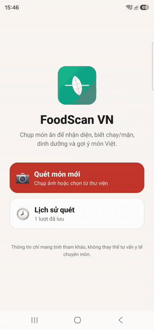

# FoodScan VN

Android app (Expo / React Native + TypeScript) that scans a food photo and shows
Vietnamese nutrition info, vegetarian (**chay**) status, health notes, and dish
suggestions — powered by Gemini + a local Vietnamese food-composition database.
Personal project.

<p align="center">
  
</p>

## What it does

Point the camera at a food item (or pick a photo) → Gemini identifies it → the app
shows:

- **What it is** — Vietnamese name, matched against the local food catalog.
- **Vegetarian (chay) status** — with a food-group guard override (meat / fish /
  egg / dairy) and ngũ vị tân awareness.
- **Curated nutrition** — from the local Vietnamese National Institute of Nutrition
  Food Composition Table (526 foods, 87 nutrients). Falls back to an AI estimate,
  clearly badged **"Ước tính bởi AI"**, when there's no local match.
- **Benefits, risks, and suggested Vietnamese dishes.**
- **Scan history** — past scans are saved locally (SQLite) and re-viewable without
  re-calling Gemini.
- **Name search + food photos** — look up any food by Vietnamese or English name
  without a photo; the detail screen shows Wikimedia Commons photos of the food
  (searched by its English name, cached locally for 24h) so you know what it looks
  like.

The UI is Vietnamese-first. Everything runs on-device — no backend, no auth, no
cloud sync. See [`SPEC.md`](SPEC.md) for the full design and [`PROGRESS.md`](PROGRESS.md)
for build status.

## How it works

- **Nutrition data** — a 526-food Vietnamese composition table is shipped as
  `assets/nutrition-seed.json`, bulk-imported into SQLite on first launch.
- **Identification** — the full food catalog (code ␉ name_vn ␉ name_en) is grounded
  into the Gemini prompt so it returns an exact `matched_food_code`; the app looks
  that up locally, falling back to fuzzy token-overlap matching.
- **Model fallback** — the Gemini client tries a chain of models and advances to the
  next one on rate-limit (HTTP 429).

## Prerequisites

- Node.js (LTS) and npm
- A free **Gemini API key** — <https://aistudio.google.com/apikey>
- Food photos come from **Wikimedia Commons** — no API key needed. If a food
  has no matching photo the strip on the detail screen just stays hidden.
- Android device or emulator. Camera + SQLite need a **custom dev client**
  (not Expo Go) — the app runs via `expo run:android`.
- Expo SDK 54 · React Native 0.81 · React 19

## Setup

```bash
# 1. Install dependencies
npm install

# 2. Configure your API keys
cp .env.example .env
#   then edit .env and set EXPO_PUBLIC_GEMINI_API_KEY=<your key>
#   optionally set EXPO_PUBLIC_PIXABAY_API_KEY=<your key> for food photos

# 3. Build and run on a connected Android device / emulator
npm run android
```

Optionally override the model fallback chain in `.env`:

```
EXPO_PUBLIC_GEMINI_MODELS=gemini-3.5-flash,gemini-2.5-flash,gemini-3.1-flash-lite
```

## Project layout

```
src/
  data/         SQLite (db, seed, repos), Gemini client + prompt/schema
  domain/       food identification, vegetarian guard, nutrition selection
  ...           screens & UI components
assets/         app icons, nutrition-seed.json, demo.gif
```

> **Note:** `.env` (your API key), raw `*.mp4` screen recordings, and the
> one-time `data-prep/` extraction are gitignored.

## Disclaimer

Nutrition values and AI estimates are informational only and **not medical
advice**.

## License

See [`LICENSE`](LICENSE).
